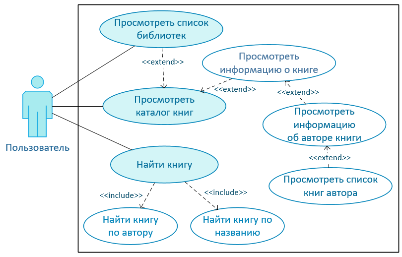

# Web-портал BOOK SEA

Web-портал **BOOK SEA** - ***библиотечная система для поиска и заказа книг***, имеющая ***микросервисную архитектуру***. Микросервисы взаимодействуют между собой по по протоколу ***HTTP*** и реализованы с помощью ***REST***, в системе предусмотрена ***межсервисная авторизация***, ***отказоустойчивость***, все сервисы собираются и разворачиваются с помощью ***CI/CD***.

Данная система была разработана в рамках курсового проекта по курсу "Распределённые системы обработки информации". Требования к программной реализации проекта представлены в [technical_specification.md](technical_specification.md).

### Особенности реализации
- язык Ruby и фреймворк Ruby on Rails для микросервисов бэкенда;
- Javascript и фреймворк Vue.js для фронтенда;
- СУБД Postgres;
- межсервисная авторизация с помощью JWT-токенов;
- брокер сообщений RabbitMQ и 2 очереди для асинхронной отправки данных в сервис статистики;
- тестирование API с помощью коллекций тестов Postman (см. папку [postman](postman));
- развёртывание системы на Kubernetes (см. папку `kube` в директории каждого сервиса);
- автоматизация сборки, тестирования и развёртывания с помощью инструмента для CI/CD - GitHub Actions (см. файл [.github/workflows/main.yml](.github/workflows/main.yml)).

### Описание микросервисов

Система «BOOK SEA» **состоит из сервиса пользовательского интерфейса** (Web-интерфейса) и **7 подсистем**:
- сервиса авторизации (Session Service);
- сервиса-координатора (Gateway Service);
- сервиса книг (Books Service);
- сервиса библиотек (Library Service);
- централизованной системы контроля сдачи (Control Service);
- сервиса рейтинга пользователей (Rating Service);
- сервиса статистики (Report Service).

**Сервис пользовательского интерфейса** (Frontend Service) принимает запросы от пользователей по протоколу HTTP и анализирует их. На основе
проведенного анализа фронтенд выполняет запросы к бэкендам, агрегирует ответы бэкендов и отсылает ответ пользователю.  
**Сервис авторизации** (Session Service) хранит в себе информацию о пользователях и используется для пользовательской авторизации и аутентификации.  
**Сервис-координатор** (Gateway Service) представляет собой единую точку входа в систему. Он агрегирует все запросы, кроме авторизации пользователя, и направляет их на обработку конкретному сервису, затем получает от него ответ и направляет его в сервис пользовательского интерфейса.  
**Сервис книг** (Books Service) отвечает за хранение информации о книгах, добавление книг в базу данных и удаление их.  
**Сервис библиотек** (Library Service) содержит базовые функции для обеспечения работы библиотек.  
**Централизованная система контроля сдачи книг** (Control Service) отвечает за отслеживание книг, взятых пользователем в библиотеке.  
**Сервис рейтинга** (Rating Service) обеспечивает программу лояльности библиотечного портала, по которой на основе рейтинга читателя изменяется максимально допустимое количество книг, одновременно взятых в библиотеке. Рейтинг читателя увеличивается, когда он возвращает книги вовремя и в хорошем состоянии.  
**Сервис статистики** (Report Service) выполняет сбор статистики и позволяет формировать 2 вида отчётов: отчёты популярности жанров и отчёты со статистикой о книгах пользователей. Данный сервис слушает очереди взятых и возвращённых книг, в которые сервис Gateway публикует сообщения, и сохраняет их в собственную БД.

Взаимодействие микросервисов представлено на диаграмме компонентов ниже.

  

 

### Возможности пользователей

В системе выделены **следующие роли**: **неавторизированный пользователь**, **читатель** и **администратор**.
Возможности, которые предоставляются каждому типу пользователей в системе, представлены на диаграммах вариантов использования.

  
  
  

 

### Пользовательский интерфейс

1. Стартовая страница

  

2. Страница входа

  

3. Страница каталога книг

  

4. Информация о книге

  

5. Поиск книги в библиотеках

  

6. Страница автора и список его книг

  

7. Страница каталога библиотек

  

8. Операция взятия книги в библиотеке

  

9. Операция возврата книги

  

10. Профиль пользователя

  

11. Страница каталога книг (панель администратора)

  

 
12. Форма добавления книги (панель администратора)

  

13. Страница редактирования книги (панель администратора)

  

14. Операция добаления книги в библиотеку (панель администратора)

  

15. Страница книг библиотеки (панель администратора)

  

16. Страница читателей (панель администратора)

  

17. Отчёт популярности жанров на странице статистики (панель администратора)

  

18. Отчёт о книгах пользователя на странице статистики (панель администратора)

  

